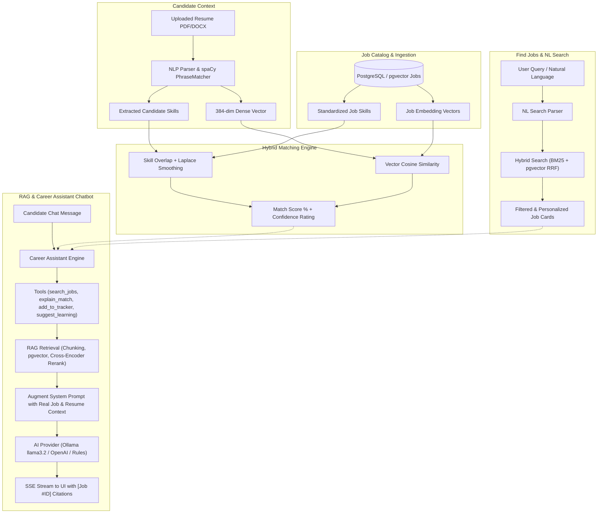
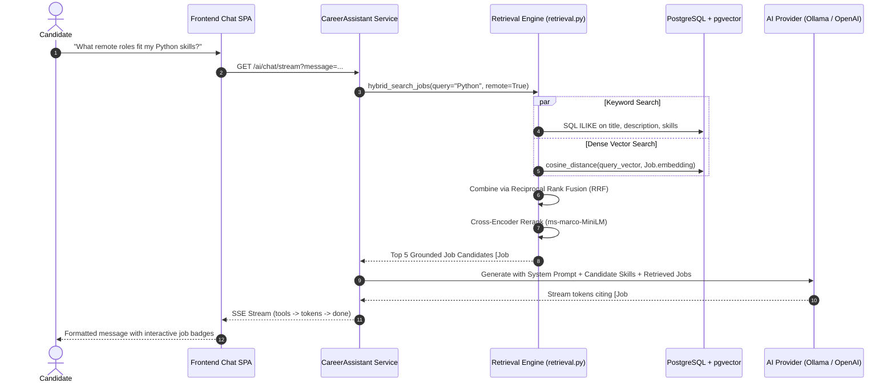

# SkillMatch AI — Job Search, Matching Engine, Career Assistant & RAG Implementation Guide

> A comprehensive technical and operational breakdown of how **SkillMatch AI** powers job discovery, calculates explainable match scores, drives the Career Assistant chatbot, and leverages Retrieval-Augmented Generation (RAG) across the entire platform.

---

## Table of Contents

1. [System Architecture & Overview](#1-system-architecture--overview)
2. [How "Find Jobs" Works (Search & Filtering)](#2-how-find-jobs-works-search--filtering)
   - [Search Flow & Multi-Faceted Filters](#search-flow--multi-faceted-filters)
   - [Natural Language Search (`/ai/nl-search`)](#natural-language-search-ainl-search)
   - [Hybrid Catalog & Real-Time Personalization](#hybrid-catalog--real-time-personalization)
3. [How "Job Matching" Works (Resume-to-Job Engine)](#3-how-job-matching-works-resume-to-job-engine)
   - [The 4-Component Matching Equation](#the-4-component-matching-equation)
   - [Bayesian / Laplace Smoothing on Skill Overlap](#bayesian--laplace-smoothing-on-skill-overlap)
   - [Confidence Scoring & Safe Fallbacks](#confidence-scoring--safe-fallbacks)
   - [Explainability & "Why This Match"](#explainability--why-this-match)
4. [How the Career Assistant Chatbot Works](#4-how-the-career-assistant-chatbot-works)
   - [Candidate & Job Context Injection](#candidate--job-context-injection)
   - [Integrated Tool Calling Engine](#integrated-tool-calling-engine)
   - [Real-Time SSE Streaming & Job Citations](#real-time-sse-streaming--job-citations)
5. [How RAG (Retrieval-Augmented Generation) is Implemented](#5-how-rag-retrieval-augmented-generation-is-implemented)
   - [Semantic Chunking (`chunk_text`)](#1-semantic-chunking-chunk_text)
   - [Dense Vector Generation (`sentence-transformers`)](#2-dense-vector-generation-sentence-transformers)
   - [Hybrid Search & Reciprocal Rank Fusion (`hybrid_search_jobs`)](#3-hybrid-search--reciprocal-rank-fusion-hybrid_search_jobs)
   - [Cross-Encoder Reranking (`cross_encoder_rerank`)](#4-cross-encoder-reranking-cross_encoder_rerank)
   - [Prompt Augmentation & Grounded Synthesis](#5-prompt-augmentation--grounded-synthesis)
6. [End-to-End Flow: From Upload to Chat Recommendation](#6-end-to-end-flow-from-upload-to-chat-recommendation)
7. [Codebase Reference Map](#7-codebase-reference-map)

---

## 1. System Architecture & Overview

SkillMatch AI is designed around a single core principle: **transparency and explainability**. Traditional hiring platforms treat search, matching, and AI recommendations as disconnected black boxes. In SkillMatch AI, **Find Jobs**, **Job Matching**, the **Career Assistant**, and **RAG** share the same semantic embedding layer, PostgreSQL/pgvector database, and standardized 310+ skill taxonomy.



---

## 2. How "Find Jobs" Works (Search & Filtering)

The **Find Jobs** feature (`/#/jobs` in the frontend, backed by `GET /api/v1/jobs` in `backend/app/routers/jobs.py`) allows candidates and public visitors to search and filter live roles.

### Search Flow & Multi-Faceted Filters

The search repository (`jobs_page` in `backend/app/repositories/catalog.py`) executes dynamic SQL queries against active jobs with multi-condition filtering:

1. **Keyword Query (`q`)**:
   - Matches against job title, company name, location, and description using SQL `ILIKE` and trigram text indexing.
   - Also matches any job that has a tagged skill containing the query string.
2. **Geographic Filtering (`country` & `location`)**:
   - Defaults to **India** (`country="India"`) while supporting United States, United Kingdom, Germany, Canada, or All Countries.
   - Text match on `Job.location` (e.g., "Bangalore", "Remote", "New York").
3. **Experience Level (`experience_level`)**:
   - Filter by standardized tiers: `intern` (Internships), `entry` (Entry-level / Fresher), `mid` (Mid-level), `senior` (Senior / Lead).
4. **Work Style & Compensation Toggles**:
   - `remote=true`: Restricts results to roles flagged as remote.
   - `salary_disclosed=true`: Filters for positions providing explicit `salary_min` compensation values.
5. **Freshness (`days`)**:
   - Limits postings to jobs created within the last 7, 30, or 90 days.
6. **Sorting**:
   - `sort="recent"`: Orders by `Job.posted_at.desc()`.
   - `sort="relevance"`: Orders by match score when a candidate resume is available, or full-text term frequency.

---

### Natural Language Search (`/ai/nl-search`)

SkillMatch AI provides an intelligent natural language search bar (e.g., *"remote Python ML internships in India"* or *"senior react frontend paying salary"*).

1. **Endpoint**: `POST /api/v1/ai/nl-search` in `backend/app/routers/ai.py`.
2. **Parser Logic** (`backend/app/services/nl_search.py`):
   - **LLM Structured Parser**: If local Ollama or OpenAI is active, a structured prompt extracts a typed JSON filter:
     ```json
     {
       "q": "Python ML",
       "experience_level": "intern",
       "remote": true,
       "country": "India",
       "salary_disclosed": false
     }
     ```
   - **Deterministic Fallback**: If LLM is offline or in test environments, regex heuristics detect experience keywords (`internship` $\rightarrow$ `intern`, `senior` $\rightarrow$ `senior`), remote keywords (`wfh`, `remote` $\rightarrow$ `True`), country tokens, and strips stop words to formulate the clean `q` query.
3. **Execution**: The extracted filters are automatically mapped into the `jobs_page()` query, returning both the structured filter tags and the matching job list to the UI in one step.

---

### Hybrid Catalog & Real-Time Personalization

When a logged-in candidate browses jobs, the `personalized()` helper in `jobs.py`:
- Looks up the candidate's latest primary resume.
- Reads or calculates the `MatchResult` for each job.
- Attaches the percentage match score (e.g., `85% match`), confidence badge (`High confidence` vs `Low confidence`), matched skills, and saved status.
- Never reveals confidential recruiter notes or internal application ids.

---

## 3. How "Job Matching" Works (Resume-to-Job Engine)

Resume-to-job matching (`backend/app/services/matching.py`) is deterministic, explainable, and multi-dimensional.

### The 4-Component Matching Equation

A final match score (0% to 100%) is computed across four weighted pillars:

$$\text{Final Score} = \frac{w_{\text{sem}} \cdot S_{\text{sem}} + w_{\text{skills}} \cdot S_{\text{skills}} + w_{\text{exp}} \cdot S_{\text{exp}} + w_{\text{loc}} \cdot S_{\text{loc}}}{\sum w_{\text{active}}}$$

Default configurable weights (from `app.config.Settings`):
- **Semantic Vector Similarity** ($w_{\text{sem}} = 0.40$): Cosine similarity between candidate resume embedding and job description embedding.
- **Skill Taxonomy Overlap** ($w_{\text{skills}} = 0.35$): Overlap between verified candidate skills and job requirements.
- **Experience Level Fit** ($w_{\text{exp}} = 0.15$): Candidate years of experience vs. job minimum requirement.
- **Location & Remote Preference** ($w_{\text{loc}} = 0.10$): Matches candidate preferences against role location.

> **Crucial Rule**: If a component is unavailable (e.g., no location preference set), it is **not counted as 0%**. The active weights are normalized dynamically so candidates are never penalized for missing optional fields.

---

### Bayesian / Laplace Smoothing on Skill Overlap

In standard keyword matchers, a job with only 1 skill (e.g., `Git`) would give a candidate with `Git` a **100% skill score**. This causes sparse or incomplete job postings to crowd out well-specified roles.

SkillMatch AI applies **Bayesian / Laplace smoothing** with parameter $k = 2.0$:

$$S_{\text{skills}} = 100 \times \frac{\sum \text{weight}(\text{matched\_skills})}{\sum \text{weight}(\text{job\_skills}) + k}$$

- **Required Skills** carry a weight of `1.0`.
- **Nice-to-have / Preferred Skills** carry a weight of `0.4`.
- If a job has 1 skill and candidate matches it: $\frac{1.0}{1.0 + 2.0} = 33.3\%$ (preventing false 100% spikes).
- If a job has 10 skills and candidate matches 9: $\frac{9.0}{10.0 + 2.0} = 75.0\%$.

---

### Confidence Scoring & Safe Fallbacks

1. **High Confidence vs Low Confidence**:
   - A job is tagged **High confidence** only if:
     - The job has $\ge 3$ extracted skills, AND
     - Semantic vector embedding is present.
   - Otherwise, the UI explicitly displays a **Low confidence** badge so candidates understand the role has sparse requirements.
2. **Minimum Evidence Rule**:
   - When semantic embeddings are temporarily missing (e.g., during async worker queue processing):
     - If `matched_skills == 0` $\rightarrow$ Score is capped at **0%**.
     - If `matched_skills < 2` $\rightarrow$ Score is capped at **50%**.
     - Otherwise $\rightarrow$ Score is capped at **65%**.

---

### Explainability & "Why This Match"

For every matched job, the system provides a human-readable explanation generated by `backend/app/services/narrative.py`:
- Shows exact matched skills (e.g., `Python`, `PostgreSQL`, `FastAPI`).
- Shows missing skills (e.g., `Docker`, `Kubernetes`).
- Summarizes experience fit (e.g., *"Candidate has 3 years of experience, exceeding the required 2 years"*).
- Displays the semantic alignment percentage.

---

## 4. How the Career Assistant Chatbot Works

The Career Assistant is accessible directly via the topbar button or `/#/assistant`. It is implemented in `backend/app/services/assistant.py` and exposed via `/api/v1/ai/chat` and `/api/v1/ai/chat/stream`.

### Candidate & Job Context Injection

Unlike generic chatbots, the Career Assistant is **tightly coupled to candidate data**:

```python
# From app/services/assistant.py
candidate_summary = ""
if self.resume:
    skills_str = ", ".join([s.name for s in self.resume.skills[:12]])
    candidate_summary = (
        f"Candidate name: {self.user.name}. Documented skills: {skills_str}. "
        f"Experience: {self.resume.experience_years or 0} years."
    )
```

System Prompt Rules:
1. Ground all recommendations strictly in provided candidate context and tool results.
2. Answer directly in plain, friendly language; never mention internal tool names, JSON schemas, or function calls.
3. Always cite specific jobs as `[Job #ID]` and resume evidence as `[Resume: Section]`.
4. Never invent commands, URLs, employers, or skills.
5. If learning resources are needed, provide a personalized 3-5 step roadmap followed by curated links.

---

### Integrated Tool Calling Engine, Pydantic Coercion & Savepoint Safety

The Career Assistant does not guess answers. It leverages native LLM tool calling (Groq / OpenAI) with local single-generation fallback (Ollama) and grounded deterministic rules:

1. **Pydantic Tool Arg Coercion**:
   Every tool validates its arguments via strict Pydantic models before query execution (`SearchJobsArgs`, `RetrieveResumeContextArgs`, `GetJobDetailsArgs`, `ExplainMatchArgs`, `SuggestLearningArgs`, `AddToTrackerArgs`). Strings such as `"true"`, `"false"`, `"yes"`, `1` are coerced into real Python booleans, preventing PostgreSQL syntax errors like `jobs.remote IS $1::VARCHAR`.
2. **Savepoint (Nested Transaction) Isolation**:
   Every tool is executed inside `with db.begin_nested():`. If a tool query fails, only the savepoint rolls back—leaving the main database session clean and unpoisoned.
3. **Isolated Memory Persistence**:
   Chat messages are committed in an isolated `SessionLocal()` session. Even if an unhandled database condition occurs in the main query session, memory persistence can never break an assistant response.
4. **Intent Mapping & Automatic Filter Relaxation**:
   Conversational queries like *"Search remote Python internships"* map `"internships"` to `experience_level=intern` and `"remote"` to `remote=true`, stripping intent and stop words from `q`. If initial strict filters yield 0 results, filters are automatically relaxed (dropping remote first, then seniority level) while informing the candidate with a friendly notification note.

| Tool Method | Trigger Examples | What It Does & Security Model |
|---|---|---|
| `retrieve_resume_context` | *"What projects did I work on?"*, *"Do I have Kubernetes experience?"* | Semantic vector retrieval over candidate's resume chunks (`resume_chunks`), strictly filtered by `user_id == current_user.id`. Recruiter access blocked. Defaults to top 4 chunks. |
| `search_jobs` | *"Find remote Python jobs"*, *"Show me junior frontend openings"* | Runs hybrid search with Pydantic coercion, returning compact job cards with match scores, confidence, and missing skills. |
| `get_job_details` | *"Details for job #10"*, *"What does role 5 require?"* | Pulls complete verified job specifications, salary ranges, location, and required technical skills. |
| `explain_match` | *"Why did I match Job #12?"*, *"Explain my fit for Job 4"* | Pulls candidate resume and job details, recalculates component scores, and outputs a complete breakdown. |
| `suggest_learning` | *"How to learn Docker?"*, *"Courses for Kubernetes"*, *"Skill roadmap"* | Queries `LearningResource` table for curated free docs and cross-references candidate's resume and top matched roles. |
| `add_to_tracker` | *"Save job #5"*, *"Apply to job 10"*, *"Track Job 42"* | Creates or updates a record in candidate's Kanban application tracker (`Saved`, `Applied`, `Interview`, etc.) with user notes. |

---

### Full-Page Frontend UX (No Modal)

The assistant is delivered as a first-class, full-page workspace view (`/#/assistant`):
1. **Full-Viewport Layout**: Occupies `calc(100dvh - topbar)` with breadcrumb `"Workspace > Career Assistant"`. Modal overlays and scroll-locks are eliminated.
2. **Desktop Two-Column Grid**: Centered chat column (max-width 820px) plus collapsible 320px right Context panel displaying resume metadata, top 3 matched jobs with scores, and live tool activity.
3. **Dynamic Empty State**: Context-aware cards providing tailored prompts from candidate's real top match and primary missing skill.
4. **Markdown & Job Cards**: Sanitized Markdown rendering (bold, lists, code copy buttons, external links) and inline interactive job cards.
5. **Streaming Controls**: SSE token streaming, tool status chips (`running`, `done`, `error`), Stop button, and Retry prompt button.

---

### Real-Time SSE Streaming & Job Citations

1. **Endpoint**: `GET /api/v1/ai/chat/stream?message=...`
2. **Event Protocol**:
   - `data: {"type": "tool", "tools": [...]}`: Sent when an internal tool finishes execution (e.g., job search results or tracker updates).
   - `data: {"type": "token", "content": "..."}`: Real-time word-by-word streaming tokens for responsive UI.
   - `data: {"type": "done", "citations": ["[Job #12]", "[Job #4]"]}`: Final completion packet with clickable job citations.
3. **Frontend Interactivity**: The frontend chat window converts any `[Job #ID]` citation into a clickable badge that opens the job modal or navigates to `/#/jobs/ID`.

---

## 5. How RAG (Retrieval-Augmented Generation) is Implemented

**Retrieval-Augmented Generation (RAG)** is the technique of retrieving relevant facts from private knowledge bases (candidate resumes, job catalogs, learning resources) before sending the prompt to the language model. This eliminates hallucinations and keeps all AI suggestions factual and explainable.

The RAG pipeline is implemented in `backend/app/services/retrieval.py`.



### 1. Semantic Chunking (`chunk_text`)

Documents and extensive job postings are segmented into overlapping semantic chunks:
- `chunk_size = 400` characters.
- `overlap = 80` characters.
- Preserves paragraph (`\n\n`) and sentence (`. `) boundaries to avoid chopping keywords in half.

### 2. Dense Vector Generation (`sentence-transformers`)

Embeddings are generated via `sentence-transformers/all-MiniLM-L6-v2` (`backend/app/services/embeddings.py`):
- Outputs a normalized 384-dimensional dense vector.
- Vectorized text includes: `Title`, `Company`, `Description`, and comma-separated `Skills`.
- Stored directly in PostgreSQL using `pgvector` (`Job.embedding` and `Resume.embedding`).

### 3. Hybrid Search & Reciprocal Rank Fusion (`hybrid_search_jobs`)

Pure vector search struggles with exact technical acronyms (e.g., `AWS`, `GCP`, `C++`), while pure keyword search misses synonyms. SkillMatch AI combines both using **Reciprocal Rank Fusion (RRF)**:

$$RRF\_Score(d) = \sum_{m \in \{\text{text}, \text{vector}\}} \frac{1}{60 + \text{rank}_m(d)}$$

1. **Text Query**: Retrieves top $2 \times N$ jobs matching tokens via SQL `ILIKE`.
2. **Vector Query**: Retrieves top $2 \times N$ jobs matching cosine distance via `Job.embedding.cosine_distance(query_vector)`.
3. **Fusion**: RRF merges the ranks into an interleaved list, penalizing single-method outliers and elevating documents that rank well in both keyword and semantic searches.

### 4. Cross-Encoder Reranking (`cross_encoder_rerank`)

For the top candidate documents retrieved by RRF, a secondary reranker scores the query-document pair:
- Model: `cross-encoder/ms-marco-MiniLM-L-6-v2`.
- Reads `[Query, Job Title + Description]` simultaneously to compute a deep contextual relevance score.
- **Lexical Fallback**: If the cross-encoder PyTorch model is omitted in lightweight Docker deployments, a term-coverage ranker automatically scores candidates based on token overlap and existing match strength.

### 5. Prompt Augmentation & Grounded Synthesis

The final step of RAG synthesizes the response:
1. Candidate profile (verified skills, years of experience) is placed in the `system_prompt`.
2. The retrieved jobs, component match scores, and learning resources are passed as structured JSON in the `prompt`.
3. The LLM produces a grounded, conversational answer citing `[Job #ID]` tags.
4. If an LLM is not installed locally, the `grounded_rules` fallback engine formats the tool execution output cleanly without failing.

---

## 6. End-to-End Flow: From Upload to Chat Recommendation

Here is how the entire system executes in practice:

1. **Resume Upload**: Candidate uploads a PDF resume at `/#/upload`.
2. **Parsing & Vectorizing**:
   - `extract_skills()` identifies standardized skills (`Python`, `FastAPI`, `PostgreSQL`, `Docker`, etc.).
   - `sentence-transformers` generates the 384-dim candidate embedding vector.
3. **Background Worker Matching**:
   - `MatchWorker` calculates match scores against all active jobs in catalog.
   - Applies Bayesian smoothing and confidence rules.
   - Caches results in the `match_results` table.
4. **Candidate Searches for Jobs**:
   - Types *"remote python backend"* in the Find Jobs search bar.
   - NL search converts query to structured filters (`q="python backend"`, `remote=true`).
   - Results display with live match scores (e.g., `92% match`, `High confidence`).
5. **Candidate Interacts with Career Assistant**:
   - Asks: *"Why am I an 92% match for Job #8 and what should I learn to improve?"*
   - Assistant executes `tool_explain_match(job_id=8)` via RAG.
   - Retrieves matched skills (`Python`, `FastAPI`), missing skills (`Kubernetes`), and experience fit.
   - Assistant executes `tool_suggest_learning(skill_name="Kubernetes")`.
   - Streams reply via SSE: *"You match [Job #8] Backend Engineer at Acme because your 3 years of FastAPI and Python experience strongly align. To improve from 92% to 98%, consider reviewing Kubernetes basics: [Official Kubernetes Documentation](https://devdocs.io/#q=kubernetes)."*
6. **Action Execution**:
   - Candidate types: *"Save Job #8 to my tracker."*
   - Assistant executes `tool_add_to_tracker(job_id=8, status="Saved")`.
   - Job immediately appears in the candidate's Kanban board at `/#/applications`.

---

## 7. Codebase Reference Map

| Component / Function | File Path | Primary Responsibility |
|---|---|---|
| **Jobs API Router** | `backend/app/routers/jobs.py` | Job listing, country/remote/salary filtering, personalized match scores. |
| **Catalog Repository** | `backend/app/repositories/catalog.py` | SQL queries, pagination, cursor management, skill linking. |
| **NL Search Parser** | `backend/app/services/nl_search.py` | Converts conversational text into structured search filters. |
| **Matching Engine** | `backend/app/services/matching.py` | 4-pillar scoring, Bayesian smoothing ($k=2$), confidence badges. |
| **Career Assistant Engine** | `backend/app/services/assistant.py` | Chat orchestration, tool calling, candidate context grounding, SSE generation. |
| **RAG & Retrieval Service** | `backend/app/services/retrieval.py` | Semantic chunking, pgvector hybrid search, Reciprocal Rank Fusion, Cross-Encoder reranking. |
| **Embeddings Service** | `backend/app/services/embeddings.py` | Sentence-Transformers MiniLM vector encoding and cosine similarity. |
| **AI Router** | `backend/app/routers/ai.py` | Endpoints for `/ai/nl-search`, `/ai/chat`, `/ai/chat/stream`, `/ai/why-match`. |
| **Frontend SPA Client** | `frontend/src/main.ts` | Search forms, match cards, Kanban board, streaming chat modal UI. |
