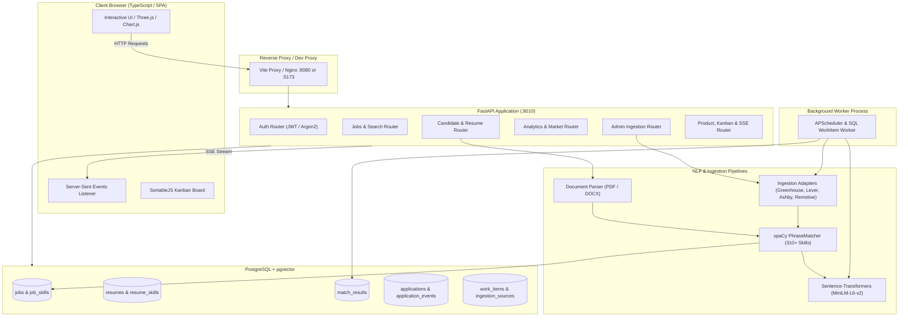
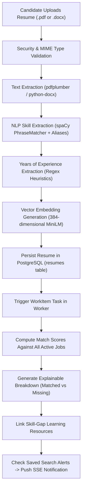
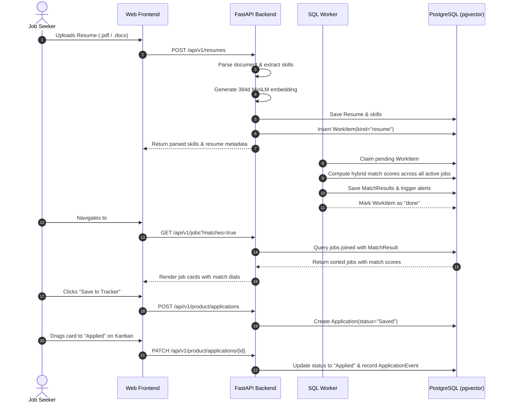
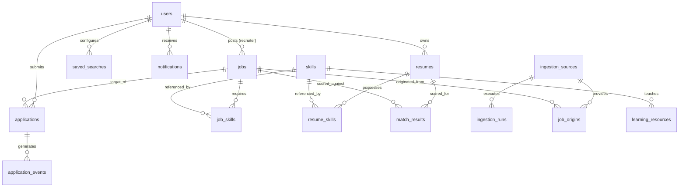

# SkillMatch AI — Complete System Architecture & Operational Guide

> An end-to-end reference explaining how **SkillMatch AI** ingests live jobs from official APIs, processes and matches candidate resumes with hybrid intelligence, and powers interactive dashboards for candidates, recruiters, and platform administrators.

---

## Table of Contents

1. [Executive Summary & Technology Stack](#1-executive-summary--technology-stack)
2. [End-to-End System Architecture](#2-end-to-end-system-architecture)
3. [Deep Dive: How Jobs are Ingested from External APIs](#3-deep-dive-how-jobs-are-ingested-from-external-apis)
   - [Supported API Adapters](#supported-api-adapters)
   - [Normalization & Text Cleaning](#normalization--text-cleaning)
   - [Deduplication & Fuzzy Fingerprinting](#deduplication--fuzzy-fingerprinting)
   - [Skill & Experience Extraction on Ingested Jobs](#skill--experience-extraction-on-ingested-jobs)
   - [Worker Scheduling & Rate Limiting](#worker-scheduling--rate-limiting)
4. [Deep Dive: What Happens After You Upload a Resume](#4-deep-dive-what-happens-after-you-upload-a-resume)
   - [Stage 1: File Ingestion & Security Validation](#stage-1-file-ingestion--security-validation)
   - [Stage 2: Text & Document Parsing](#stage-2-text--document-parsing)
   - [Stage 3: Standardized Skill Taxonomy Extraction](#stage-3-standardized-skill-taxonomy-extraction)
   - [Stage 4: Semantic Vector Embedding Generation](#stage-4-semantic-vector-embedding-generation)
   - [Stage 5: The Hybrid Matching Algorithm](#stage-5-the-hybrid-matching-algorithm)
   - [Stage 6: ATS Heuristic Checks & Skill Gap Detection](#stage-6-ats-heuristic-checks--skill-gap-detection)
   - [Stage 7: Work Queue, Notifications & Real-Time Alerts](#stage-7-work-queue-notifications--real-time-alerts)
5. [Comprehensive Tour of All Dashboards & Views](#5-comprehensive-tour-of-all-dashboards--views)
   - [1. Candidate Dashboard](#1-candidate-dashboard)
   - [2. Public Job Explorer & Detail View](#2-public-job-explorer--detail-view)
   - [3. Personalized Job Matches & Why This Match Modal](#3-personalized-job-matches--why-this-match-modal)
   - [4. Kanban Application Tracker](#4-kanban-application-tracker)
   - [5. Resume Tools, ATS Inspector & AI Writer](#5-resume-tools-ats-inspector--ai-writer)
   - [6. Personalized Learning Path & Skill Gap Explorer](#6-personalized-learning-path--skill-gap-explorer)
   - [7. Market Insights & Interactive Analytics](#7-market-insights--interactive-analytics)
   - [8. Recruiter Workspace & Candidate Discovery](#8-recruiter-workspace--candidate-discovery)
   - [9. Administrator Source Control & Ingestion Dashboard](#9-administrator-source-control--ingestion-dashboard)
   - [10. Saved Searches, Real-Time SSE Alerts & Settings](#10-saved-searches-real-time-sse-alerts--settings)
6. [Data Flow Diagrams](#6-data-flow-diagrams)
7. [Database Schema & Entity Relationships](#7-database-schema--entity-relationships)
8. [Quick Start & Run Reference](#8-quick-start--run-reference)

---

## 1. Executive Summary & Technology Stack

**SkillMatch AI** bridges the gap between job seekers and employers by replacing "black-box" recruitment algorithms with a fully explainable, transparent, and verified matching engine.

### Core Stack
| Layer | Technologies Used | Key Responsibility |
|---|---|---|
| **Frontend UI** | TypeScript, jQuery 3.7, Bootstrap 5, Lucide Icons, GSAP, Three.js, Chart.js, SortableJS | Responsive single-page application (SPA) with 60 FPS hero animations, Kanban board, charts, and zero framework overhead. |
| **Frontend Build & Proxy** | Vite 6 | Development server with automatic proxying of `/api`, `/docs`, and `/openapi.json` to the backend. |
| **Backend API** | FastAPI (Python 3.10+), Pydantic v2, SlowAPI, PyJWT, pwdlib (Argon2) | High-performance asynchronous REST API, HTTP-only cookie security, rate limiting, and real-time SSE streaming. |
| **Database & Vectors** | PostgreSQL + `pgvector` extension (Neon DB or local Docker pgvector) | Stores jobs, users, resumes, applications, and 384-dimensional dense vector embeddings with trigram text search. |
| **ML & NLP Models** | `sentence-transformers/all-MiniLM-L6-v2`, `spaCy` (PhraseMatcher) | Generates 384-dimensional embeddings for deep semantic comparison; extracts skills against a 310+ skill taxonomy. |
| **Background Worker** | APScheduler, durable SQL Task Queue (`WorkItem`) | Asynchronously handles resume re-indexing, catalog embedding, recurring feed ingestion, and digest notifications. |
| **Local AI Assistance** | Ollama (`llama3.2` model, optional) | Local LLM for drafting cover letters, summary enhancements, and interview prep suggestions. |

---

## 2. End-to-End System Architecture



---

## 3. Deep Dive: How Jobs are Ingested from External APIs

Unlike tools that rely on fragile, non-compliant web scraping, SkillMatch AI connects exclusively to **official public endpoints and developer job board APIs**. Arbitrary HTML scraping of portals like LinkedIn, Indeed, or Naukri is deliberately rejected to maintain compliance, speed, and clean structured data.

### Supported API Adapters
Located in [`backend/app/ingestion/adapters.py`](file:///c:/Users/MOHIT/OneDrive/Desktop/personal_pro/ost-project/backend/app/ingestion/adapters.py):

| Source | Target API / Mechanism | Data Extracted & Special Handling |
|---|---|---|
| **Greenhouse** | `https://boards-api.greenhouse.io/v1/boards/{slug}/jobs?content=true` | Reads official JSON. Extracts full job HTML content converted to clean plaintext, job title, office location, remote status, and external apply URL. |
| **Lever** | `https://api.lever.co/v0/postings/{slug}?mode=json` | Reads paginated postings (100 per page). Extracts structured category commitments (Full-time, Intern), workplace type (remote/onsite), and Lever salary range objects (`min`, `max`, `currency`, `interval`). |
| **Ashby** | `https://api.ashbyhq.com/posting-api/job-board/{slug}` with `includeCompensation=true` | Reads publicly listed roles. Isolates genuine base salary components from equity/bonuses to prevent skewed market statistics. |
| **Remotive** | `https://remotive.com/api/remote-jobs` | Ingests curated remote tech listings with required candidate locations, publication dates, and attribution links. Enforces a 6-hour delay policy to respect provider terms. |
| **Arbeitnow** | `https://www.arbeitnow.com/api/job-board-api` | Public European and international tech job feed with pagination and remote tags. |
| **RemoteOK** | `https://remoteok.com/api` | Tech feed reading legal metadata, tags, salary strings, and direct source URLs. |
| **Adzuna** | Official REST API with authorized App ID & Key | Queries localized country vacancies with specific category parameters. |

### Normalization & Text Cleaning
When an adapter reads raw data, it instantiates a standardized Pydantic `RawJob` dataclass:
1. **Plain Text Cleaning**: Removes HTML entities (`&amp;`, `&nbsp;`), converts headings and list tags (`<li>`, `<p>`, `<br>`) to clean uniform line breaks, and trims repetitive whitespace.
2. **Salary Extraction**:
   - If the API provides explicit numeric fields (Lever, Ashby), they are parsed directly into `salary_min`, `salary_max`, `salary_currency`, and `salary_interval` (`year`, `month`, `hour`).
   - If salary is embedded as raw text (e.g., "$120,000 - $160,000 / year"), an extraction regex identifies the currency symbol (`$`, `€`, `£`), numeric bounds, and pay frequency.
   - If no verifiable salary exists, fields remain `NULL`. The system **never fabricates or guesses** salary numbers.
3. **Role Scope Relevance Filter (`role_scope: cse`)**:
   - For curated tech engineering sources (e.g., Palantir, Together AI, Cohere), [`backend/app/ingestion/relevance.py`](file:///c:/Users/MOHIT/OneDrive/Desktop/personal_pro/ost-project/backend/app/ingestion/relevance.py) applies a deterministic filter to retain Computer Science & Engineering positions (SWE, SRE, ML/AI, Data Engineering, Cloud, Security) while excluding unrelated listings like Sales, Account Executives, or Office Management.

### Deduplication & Fuzzy Fingerprinting
To prevent duplicate job records across different sources or recurring ingestion runs:
1. **Composite Fingerprint**: A deterministic hash is generated using `title + company + location`:
   ```python
   fingerprint = hashlib.sha256(f"{normalized(title)}|{normalized(company)}|{normalized(location)}".encode()).hexdigest()[:32]
   ```
2. **Fuzzy Sequence Matcher**: If a job listing has slight title variations across job boards, Python’s `SequenceMatcher` compares existing active listings for the same company and location. A similarity score $\ge 0.94$ flags the job as an existing listing rather than creating a duplicate.
3. **Multi-Source Attribution (`JobOrigin`)**: If both Greenhouse and Remotive advertise the same role, SkillMatch AI maintains a single canonical `Job` entity while attaching multiple `JobOrigin` records. Both source links and attributions remain accessible to candidates.
4. **Content Hash Check**: A SHA-256 hash of the entire job payload is stored. If a company refreshes its feed but the job description, location, and salary haven't changed, the record is touched without triggering unnecessary database rewrites or vector re-embeddings.

### Skill & Experience Extraction on Ingested Jobs
Every newly created or modified job is automatically processed:
- **Taxonomy Skill Scanning**: The text is scanned against the 310+ canonical skill vocabulary using `spaCy`'s phrase matcher.
- **Skill Importance Classifier (`importance()`)**:
  - The job description is parsed line by line.
  - Skills occurring under phrases like *"Requirements"*, *"Must-have"*, or *"Qualifications"* are marked `required`.
  - Skills occurring under *"Nice to have"*, *"Bonus"*, or *"Preferred"* are marked `nice-to-have`.
- **Minimum Experience Detection (`experience()`)**:
  - Regular expressions look for patterns such as `"3+ years of professional experience"` or `"5-7 years experience"` to record `experience_min`.

### Worker Scheduling & Rate Limiting
- Handled by [`backend/app/worker.py`](file:///c:/Users/MOHIT/OneDrive/Desktop/personal_pro/ost-project/backend/app/worker.py) using `APScheduler`.
- Each source has a configurable `interval_minutes` (defaulting to 360 or 720 minutes).
- Requests use courteous user-agent headers (`SkillMatchAI/2.0`), handle HTTP `ETag` and `If-Modified-Since` headers to prevent downloading un-modified data, and enforce exponential backoff if an endpoint responds with a 429 or 5xx status.

---

## 4. Deep Dive: What Happens After You Upload a Resume

When a candidate uploads their resume on the **Upload** page, an automated 7-stage intelligence pipeline executes:



### Stage 1: File Ingestion & Security Validation
- Located in [`backend/app/services/parsing.py`](file:///c:/Users/MOHIT/OneDrive/Desktop/personal_pro/ost-project/backend/app/services/parsing.py).
- Enforces strict constraints: Maximum file size is **5 MB**; maximum page length is **20 pages**.
- Magic byte validation:
  - PDFs must begin with `%PDF-`.
  - DOCX files must be valid zip archives containing `word/document.xml` with uncompressed size under **25 MB** (preventing zip-bomb attacks).
  - Unencrypted, non-corrupt files are required.

### Stage 2: Text & Document Parsing
- **PDF**: Processed using `pdfplumber`, extracting text page by page while preserving paragraph breaks.
- **DOCX**: Processed using `python-docx`, traversing both body paragraphs and embedded table cells.
- If fewer than 30 characters of readable text are extracted, the upload is rejected with a clear message informing the user that scanned image PDFs require OCR before upload.

### Stage 3: Standardized Skill Taxonomy Extraction
SkillMatch AI matches resumes using a curated taxonomy of **310+ technical and professional skills** defined in [`backend/app/services/taxonomy.py`](file:///c:/Users/MOHIT/OneDrive/Desktop/personal_pro/ost-project/backend/app/services/taxonomy.py).
- **Fast Phrase Matching**: A `spaCy` `PhraseMatcher` builds an in-memory token trie. Matching runs in linear time regardless of resume length.
- **Alias Normalization**: Synonyms and abbreviations map to their canonical standard:
  - `"k8s"` $\rightarrow$ `"Kubernetes"`
  - `"react.js"`, `"reactjs"` $\rightarrow$ `"React"`
  - `"postgres"`, `"psql"` $\rightarrow$ `"PostgreSQL"`
  - `"golang"` $\rightarrow$ `"Go"`
  - `"amazon web services"` $\rightarrow$ `"AWS"`
  - `"gcp"` $\rightarrow$ `"Google Cloud"`
- Extracted skills are stored in the `resume_skills` join table.

### Stage 4: Semantic Vector Embedding Generation
- Located in [`backend/app/services/embeddings.py`](file:///c:/Users/MOHIT/OneDrive/Desktop/personal_pro/ost-project/backend/app/services/embeddings.py).
- If `SEMANTIC_ENABLED=true` in `.env`, the cleaned resume text is encoded using the **`sentence-transformers/all-MiniLM-L6-v2`** model.
- It produces a dense vector of **384 floating-point dimensions** representing the semantic meaning, technical depth, and contextual vocabulary of the candidate's career history.
- In PostgreSQL, this vector is stored in a native `vector(384)` column enabled by `pgvector`. (In local SQLite mode, it falls back to a JSON column with pure lexical matching).

### Stage 5: The Hybrid Matching Algorithm
Located in [`backend/app/services/matching.py`](file:///c:/Users/MOHIT/OneDrive/Desktop/personal_pro/ost-project/backend/app/services/matching.py), the engine evaluates candidates against jobs using four distinct dimensions:

$$\text{Final Score} = \frac{\sum (V_i \times W_i)}{\sum W_i}$$

| Component | Default Weight | How It Is Calculated |
|---|---|---|
| **Semantic Similarity** | **50%** ($0.50$) | Cosine similarity between the candidate's 384d vector embedding and the job's 384d vector embedding: $\frac{\vec{A} \cdot \vec{B}}{\|\vec{A}\| \|\vec{B}\|} \times 100$. Captures conceptual alignment even when exact words differ. |
| **Taxonomy Skills Overlap** | **30%** ($0.30$) | Weighted intersection of candidate skills vs job skills. Skills marked `required` carry a $1.0$ weight; skills marked `nice-to-have` carry a $0.4$ weight. |
| **Experience Fit** | **15%** ($0.15$) | Compares candidate years of experience against `job.experience_min`: $\min(100, \frac{\text{Years}}{\text{Required}} \times 100)$. |
| **Location & Remote Preference** | **5%** ($0.05$) | Compares candidate location preferences and remote selection (`remote`, `onsite`, `any`) against the job listing's location. |

> **Dynamic Weight Normalization**: If a job does not disclose experience requirements, or if the candidate hasn't specified location preferences, the algorithm **does not penalize the candidate by scoring zero**. Instead, it dynamically re-normalizes the active components so that the score remains accurate and fair.

### Stage 6: ATS Heuristic Checks & Skill Gap Detection
Immediately following parsing, the system performs an ATS-style document analysis:
- **Section Detection**: Checks for standard headings: *Experience/Work History*, *Education*, *Skills*, and *Contact Information*.
- **Length & Readability**: Checks whether the document falls in the ideal 250–1,500 word range.
- **Formatting Checks**: Inspects bullet-point markers (`•`, `-`, `*`) and scans for corrupted Unicode replacement characters (`\ufffd`).
- **Skill Gap Identification**: Determines every skill required by the target job that is missing from the candidate's resume, and queries the `learning_resources` table to recommend free courses and tutorials (e.g., Python.org, PyTorch.org, Hugging Face LLM Course, MDN).

### Stage 7: Work Queue, Notifications & Real-Time Alerts
- The API enqueues a `WorkItem(kind="resume", payload={"resume_id": ...})`.
- The background worker executes the matching calculations across all active jobs.
- The worker executes [`create_alerts()`](file:///c:/Users/MOHIT/OneDrive/Desktop/personal_pro/ost-project/backend/app/services/product.py): If any newly matched job meets a candidate's **Saved Search** criteria, a new `Notification` is stored in the database.
- Candidates actively browsing the app receive an instant real-time alert via the Server-Sent Events (SSE) notification stream.

---

## 5. Comprehensive Tour of All Dashboards & Views

### 1. Candidate Dashboard
- **Route**: `#dashboard`
- **Purpose**: Central command center for job seekers.
- **Key Features**:
  - **Quick Stats Bar**: Live count of active job applications, scheduled interviews, saved job bookmarks, and top match percentage.
  - **Active Resume Card**: Shows filename, uploaded date, detected years of experience, and a badge pill for each extracted skill.
  - **Top Matched Jobs Preview**: Displays the top 3 recommended positions calculated for the user's latest resume, complete with match score dials.
  - **Interactive Action Tiles**: One-click shortcuts to update resume, browse jobs, inspect the Kanban board, or view market charts.

### 2. Public Job Explorer & Detail View
- **Route**: `#jobs` and `#jobs/:id`
- **Purpose**: Transparent job search accessible to all users.
- **Key Features**:
  - **Filters**: Free-text search, location filter, employment type selector (Full-time, Part-time, Contract, Internship), and a **Remote Only** toggle.
  - **Cursor-Based Pagination**: High-performance pagination ensuring instant page transitions over hundreds of stored jobs.
  - **Source Transparency**: Every job card clearly displays its origin badge (e.g., *Greenhouse*, *Lever*, *Ashby*, *Remotive*, or *Native Recruiter*).
  - **Job Detail Page**: Shows complete formatted job descriptions, salary currency/interval, full list of tagged skills, direct link to the employer's official portal, and a **Similar Jobs** carousel based on skill overlap.

### 3. Personalized Job Matches & "Why This Match?" Modal
- **Route**: `#matches`
- **Purpose**: Tailored job list ranked strictly by compatibility with the uploaded resume.
- **Key Features**:
  - **Match Dial**: Color-coded score indicators (Violet for 85%+, Emerald for 70%+).
  - **"Why This Match?" Breakdown**: Clicking any job's score dial opens an interactive dialog that reveals:
    - **Matched Skills**: Chips in emerald highlighting the skills you possess that the employer requested.
    - **Missing Skills**: Chips in amber detailing qualifications you lack, each paired with a link to free learning resources.
    - **Component Breakdown**: Percentage scores for semantic relevance, keyword overlap, experience alignment, and location fit.
  - **Direct Actions**: Candidates can directly bookmark the job or add it to their Kanban application pipeline with one click.

### 4. Kanban Application Tracker
- **Route**: `#applications`
- **Purpose**: Persisted workflow board to organize job applications.
- **Key Features**:
  - **Workflow Columns**: Seven sequential stages: `Saved` $\rightarrow$ `Applied` $\rightarrow$ `Reviewing` $\rightarrow$ `Interview` $\rightarrow$ `Offer` $\rightarrow$ `Rejected` $\rightarrow$ `Hired`.
  - **Drag-and-Drop Interaction**: Built with [SortableJS](file:///c:/Users/MOHIT/OneDrive/Desktop/personal_pro/ost-project/frontend/src/lib/workspace.ts). Dragging a job card between columns automatically persists the update to the backend database.
  - **Card Metadata**: Displays company name, position, salary estimate, applied date, and user notes.
  - **Timeline History**: Every stage transition logs an `ApplicationEvent` so candidates can view a chronological timeline of their application journey.
  - **Accessibility**: Includes a keyboard-accessible stage selector for full screen-reader and keyboard navigation compliance.

### 5. Resume Tools, ATS Inspector & AI Writer
- **Route**: `#resume-tools`
- **Purpose**: Resume optimization and preparation.
- **Key Features**:
  - **ATS Diagnostic Scorecard**: Evaluates your uploaded resume against industry ATS parsing standards, displaying checkmarks for section headers, bullet formatting, word count bounds, and character encoding.
  - **Target Job Matcher**: Select any active job to run a side-by-side keyword coverage check showing exact missing keywords.
  - **Local AI Writing Assistant**: If local [Ollama](file:///c:/Users/MOHIT/OneDrive/Desktop/personal_pro/ost-project/backend/app/config.py) is enabled, candidates can generate customized cover letters, professional summaries, and bullet point revisions based on their real resume text and the selected job description.

### 6. Personalized Learning Path & Skill Gap Explorer
- **Route**: `#learning`
- **Purpose**: Actionable skill-gap closing engine.
- **Key Features**:
  - Aggregates missing skills across all job listings that match the candidate's career interests.
  - **Job Unlock Counter**: Displays the exact number of jobs you would qualify for by mastering each skill (e.g., *"Learning Docker unlocks 18 additional job matches"*).
  - Direct links to vetted, free tutorials and documentation from official maintainers (Python, PyTorch, Scikit-Learn, MDN, PostgreSQL, Hugging Face).

### 7. Market Insights & Interactive Analytics
- **Route**: `#analytics`
- **Purpose**: Real-time hiring intelligence generated from stored jobs.
- **Key Features**:
  - **In-Demand Skills Bar Chart**: Ranks the top 30 most requested technologies across all live job postings.
  - **Salary Distribution Chart**: Visualizes salary percentiles (25th, median, 75th) grouped by currency and payment interval without mixing disparate currencies.
  - **Remote vs. Onsite Breakdown**: Donut chart displaying the proportion of fully remote, hybrid, and onsite tech jobs.
  - **Top Hiring Companies**: Identifies which organizations currently have the highest number of active engineering openings.

### 8. Recruiter Workspace & Candidate Discovery
- **Route**: `#recruiter` and `#post-job`
- **Purpose**: End-to-end recruitment hub for hiring managers.
- **Key Features**:
  - **Job Posting Studio**: Post verified native jobs specifying title, employment type, location, remote eligibility, salary brackets, and required skills.
  - **Applicant Tracking Pipeline**: Review candidates who applied to your native jobs, transition their application status, and add recruiter notes.
  - **Candidate Discovery**: Search and browse candidates ranked by compatibility with your job postings.
  - **Privacy First**: Candidate contact details and full resumes remain shielded during discovery until an actual application is submitted, ensuring privacy and non-discriminatory initial screening.

### 9. Administrator Source Control & Ingestion Dashboard
- **Route**: `#admin` and `#ingestion` (Accessible only to users with the `admin` role)
- **Purpose**: System administration and API health monitoring.
- **Key Features**:
  - **Source Table**: Real-time grid displaying every configured source adapter (Greenhouse, Lever, Ashby, Remotive, Adzuna).
  - **Status & Health**: Displays adapter state (`idle`, `running`, `error`), last run timestamp, next scheduled execution, and last error message (if any).
  - **Manual Trigger**: Run ingestion on demand with one click.
  - **Source Configuration Modal**: Edit adapter settings, polling intervals, and JSON configuration directly from the UI without touching code.
  - **Ingestion History**: Detailed logs showing added jobs, updated jobs, filtered jobs, and error logs for every run.

### 10. Saved Searches, Real-Time SSE Alerts & Settings
- **Route**: `#saved-searches` and `#settings`
- **Purpose**: User preferences, alerts, and personalization.
- **Key Features**:
  - **Saved Search Presets**: Save specific job filters (e.g., *"Remote Senior Python Engineer, min 80% match"*).
  - **Live Notifications (SSE)**: Connects to `/api/v1/product/notifications/stream` to receive real-time notifications when matching jobs are ingested.
  - **Email Digest Controls**: Opt-in to daily or weekly email summaries powered by SMTP/Mailpit.
  - **Theme Switcher**: Dark and light mode toggle with smooth CSS variable transitions and persistent profile preference storage.

---

## 6. Data Flow Diagrams

### Complete Candidate Journey



---

## 7. Database Schema & Entity Relationships

The relational architecture is optimized for fast search, vector similarity, and relational integrity:



### Key Models Overview
- **`User`**: Accounts with roles (`candidate`, `recruiter`, `admin`), password hashes (Argon2), and JSON preferences.
- **`Job`**: Unified job postings containing location, remote flags, salary brackets, `is_demo` flag, content hash, 384d vector embedding, and skill importance dictionaries.
- **`Skill`**: Canonical skill taxonomy (310+ standard technical and soft skills).
- **`Resume`**: Candidate resumes storing extracted text, experience years, and 384d dense vector embedding.
- **`MatchResult`**: Persisted hybrid score, sub-scores (semantic, keyword, experience, location), matched skill list, missing skill list, and text explanations.
- **`Application` & `ApplicationEvent`**: Kanban status tracking (`Saved`, `Applied`, `Reviewing`, `Interview`, `Offer`, `Rejected`, `Hired`) with event audit logs.
- **`IngestionSource` & `IngestionRun`**: Adapter configurations, run logs, and health statistics.
- **`WorkItem`**: SQL-backed durable task queue with retry logic and exponential backoff.

---

## 8. Quick Start & Run Reference

### Prerequisites
- **Python**: 3.10+ (virtual environment at `.venv`)
- **Node.js**: v20+ or v22+
- **Database**: PostgreSQL with `pgvector` (configured via `DATABASE_URL` in `.env`)

### Running Locally (3 Terminals)

#### Terminal 1: Backend API
```powershell
cd backend
..\.venv\Scripts\python.exe -m uvicorn app.main:app --host 127.0.0.1 --port 8010 --reload
```
- API Base URL: `http://127.0.0.1:8010`
- Interactive Swagger UI: `http://127.0.0.1:8010/docs`
- Health Endpoint: `http://127.0.0.1:8010/api/v1/health`

#### Terminal 2: Background Worker
```powershell
cd backend
..\.venv\Scripts\python.exe -m app.worker
```
- Listens to the `work_items` table.
- Executes scheduled ingestion from Greenhouse, Lever, Ashby, Remotive.
- Processes resume re-matching and saved search alerts.

#### Terminal 3: Frontend Web Server
```powershell
cd frontend
npm run dev
```
- Access UI: `http://localhost:5173`
- Vite automatically proxies `/api`, `/docs`, and `/openapi.json` to port `8010`.

---

*Document compiled for the SkillMatch AI project repository.*
